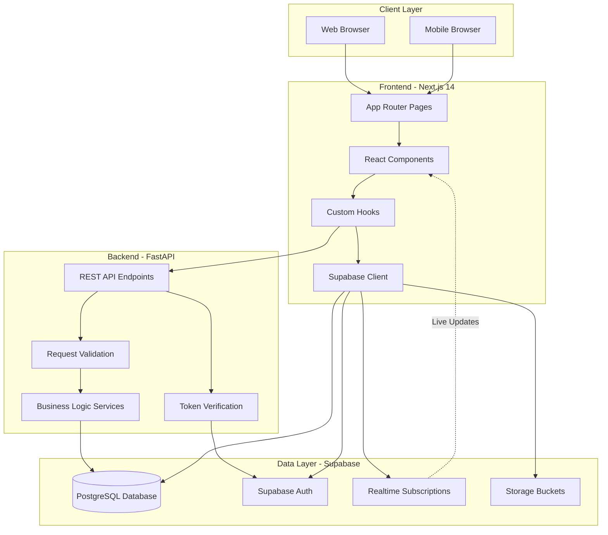
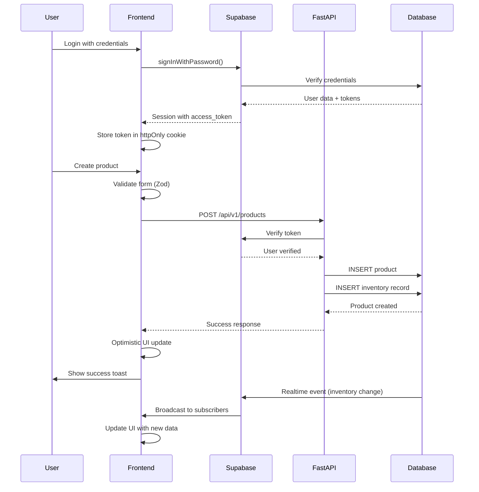
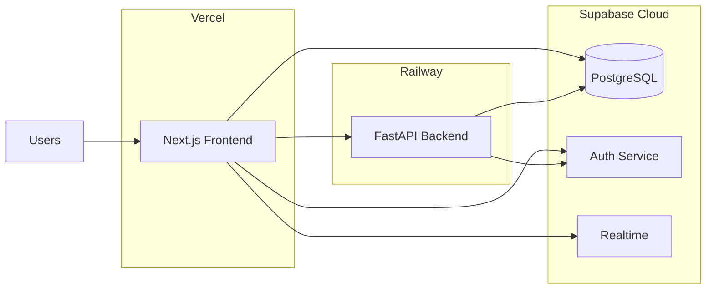
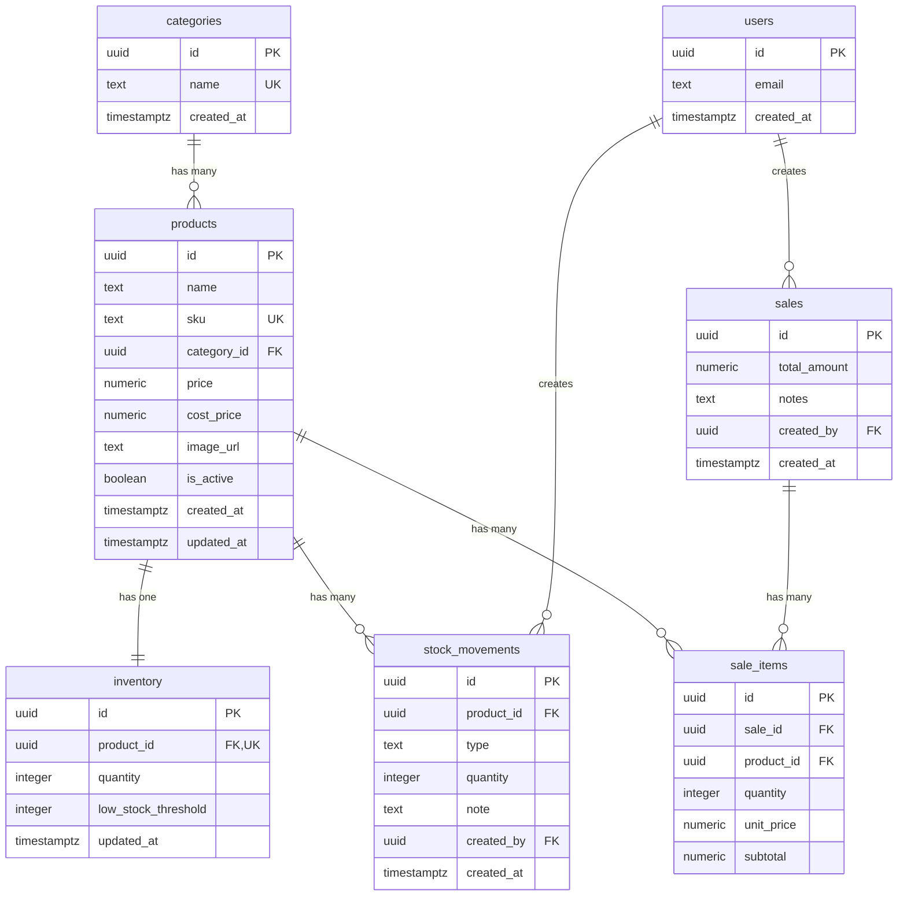
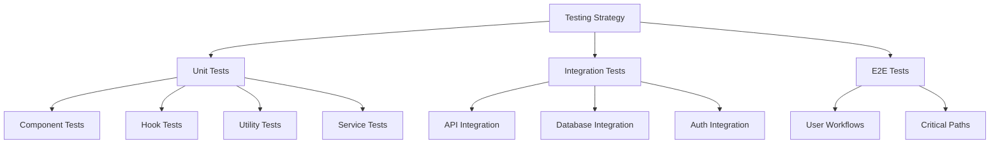

# Technical Design Document

## Overview

Talastock is a full-stack inventory and sales management dashboard designed for Filipino SMEs. The system provides real-time inventory tracking, sales recording, analytics visualization, and PDF reporting capabilities with a warm, modern user interface optimized for Philippine business operations.

### System Architecture

The application follows a modern three-tier architecture:

- **Frontend**: Next.js 14 with App Router, TypeScript, Tailwind CSS, and shadcn/ui components
- **Backend**: Python FastAPI service for business logic and API endpoints
- **Database**: Supabase (PostgreSQL) with Row Level Security for data persistence and authentication

### Key Design Principles

1. **Security-First**: RLS enabled on all tables, httpOnly cookies for tokens, input validation at all layers
2. **Real-Time Updates**: Supabase realtime subscriptions for live inventory synchronization
3. **Responsive Design**: Mobile-first approach with Talastock's warm peach/salmon color palette
4. **Performance**: Server Components by default, optimistic UI updates, efficient database queries
5. **Maintainability**: Clear separation of concerns, typed interfaces, comprehensive error handling

## Architecture

### High-Level System Architecture



### Data Flow Architecture




### Deployment Architecture




## Components and Interfaces

### Frontend Component Structure


```
frontend/
├── app/
│   ├── (auth)/
│   │   ├── login/
│   │   │   └── page.tsx                 # Login page (Server Component)
│   │   └── layout.tsx                   # Auth layout
│   ├── (dashboard)/
│   │   ├── dashboard/
│   │   │   └── page.tsx                 # Dashboard page with KPIs
│   │   ├── products/
│   │   │   └── page.tsx                 # Products list page
│   │   ├── inventory/
│   │   │   └── page.tsx                 # Inventory tracking page
│   │   ├── sales/
│   │   │   └── page.tsx                 # Sales recording page
│   │   ├── reports/
│   │   │   └── page.tsx                 # Reports export page
│   │   └── layout.tsx                   # Dashboard layout with sidebar
│   ├── middleware.ts                    # Auth middleware
│   └── layout.tsx                       # Root layout
├── components/
│   ├── ui/                              # shadcn/ui base components
│   │   ├── button.tsx
│   │   ├── input.tsx
│   │   ├── dialog.tsx
│   │   ├── table.tsx
│   │   ├── badge.tsx
│   │   ├── card.tsx
│   │   └── chart.tsx
│   ├── charts/                          # Chart components (Client)
│   │   ├── SalesChart.tsx
│   │   ├── TopProductsChart.tsx
│   │   ├── RevenueChart.tsx
│   │   └── config.ts
│   ├── tables/                          # Data table components (Client)
│   │   ├── ProductsTable.tsx
│   │   ├── InventoryTable.tsx
│   │   └── SalesTable.tsx
│   ├── forms/                           # Form components (Client)
│   │   ├── ProductForm.tsx
│   │   ├── SaleForm.tsx
│   │   └── InventoryAdjustmentForm.tsx
│   ├── layout/                          # Layout components
│   │   ├── Sidebar.tsx
│   │   ├── Header.tsx
│   │   └── EmptyState.tsx
│   └── shared/                          # Shared components
│       ├── MetricCard.tsx
│       ├── StockBadge.tsx
│       └── LoadingSkeleton.tsx
├── hooks/
│   ├── useProducts.ts                   # Product data management
│   ├── useInventory.ts                  # Inventory data management
│   ├── useSales.ts                      # Sales data management
│   └── useRealtimeInventory.ts          # Realtime subscriptions
├── lib/
│   ├── supabase.ts                      # Supabase client setup
│   ├── auth.ts                          # Auth helper functions
│   ├── api.ts                           # API client wrapper
│   └── utils.ts                         # Utility functions
├── types/
│   └── index.ts                         # TypeScript type definitions
└── styles/
    └── globals.css                      # Global styles + Tailwind
```

### Backend Service Structure


```
backend/
├── main.py                              # FastAPI app entry point
├── routers/
│   ├── products.py                      # Product CRUD endpoints
│   ├── inventory.py                     # Inventory management endpoints
│   ├── sales.py                         # Sales recording endpoints
│   ├── categories.py                    # Category management endpoints
│   └── reports.py                       # Report generation endpoints
├── services/
│   ├── product_service.py               # Product business logic
│   ├── inventory_service.py             # Inventory business logic
│   ├── sales_service.py                 # Sales business logic
│   └── report_service.py                # Report generation logic
├── models/
│   └── schemas.py                       # Pydantic models
├── database/
│   └── supabase.py                      # Supabase client setup
├── dependencies/
│   └── auth.py                          # Auth dependency injection
├── middleware/
│   ├── validation.py                    # Request validation
│   └── rate_limit.py                    # Rate limiting
└── utils/
    ├── formatters.py                    # Data formatting utilities
    └── security_logger.py               # Security event logging
```

### Key Component Interfaces

#### Frontend Components

**MetricCard Component**
```typescript
interface MetricCardProps {
  label: string
  value: string | number
  sub?: string
  icon: React.ReactNode
  danger?: boolean
}

export function MetricCard({ label, value, sub, icon, danger }: MetricCardProps): JSX.Element
```

**ProductsTable Component**
```typescript
interface ProductsTableProps {
  data: Product[]
  onEdit: (id: string) => void
  onDelete: (id: string) => void
  loading?: boolean
}

export function ProductsTable({ data, onEdit, onDelete, loading }: ProductsTableProps): JSX.Element
```

**ProductForm Component**
```typescript
interface ProductFormProps {
  initialData?: Product
  onSuccess: () => void
  onCancel: () => void
}

export function ProductForm({ initialData, onSuccess, onCancel }: ProductFormProps): JSX.Element
```

**SalesChart Component**
```typescript
interface SalesChartProps {
  data: Array<{ date: string; sales: number }>
  loading?: boolean
}

export function SalesChart({ data, loading }: SalesChartProps): JSX.Element
```

#### Custom Hooks

**useProducts Hook**
```typescript
interface UseProductsReturn {
  products: Product[]
  loading: boolean
  error: string | null
  createProduct: (data: ProductCreate) => Promise<void>
  updateProduct: (id: string, data: ProductUpdate) => Promise<void>
  deleteProduct: (id: string) => Promise<void>
  refetch: () => Promise<void>
}

export function useProducts(): UseProductsReturn
```

**useRealtimeInventory Hook**
```typescript
interface UseRealtimeInventoryReturn {
  inventory: InventoryItem[]
  connected: boolean
  error: string | null
}

export function useRealtimeInventory(): UseRealtimeInventoryReturn
```

### API Endpoints

#### Products API


| Method | Endpoint | Description | Auth Required |
|--------|----------|-------------|---------------|
| GET | `/api/v1/products` | List all active products with pagination | Yes |
| GET | `/api/v1/products/{id}` | Get single product by ID | Yes |
| POST | `/api/v1/products` | Create new product | Yes |
| PUT | `/api/v1/products/{id}` | Update existing product | Yes |
| DELETE | `/api/v1/products/{id}` | Soft delete product (set is_active=false) | Yes |
| GET | `/api/v1/products/{id}/stock-movements` | Get stock movement history for product | Yes |

**Request/Response Examples**

```typescript
// POST /api/v1/products
Request Body:
{
  "name": "Pancit Canton",
  "sku": "PC-001",
  "category_id": "uuid-here",
  "price": 15.00,
  "cost_price": 10.00,
  "image_url": null
}

Response (201):
{
  "success": true,
  "data": {
    "id": "uuid-here",
    "name": "Pancit Canton",
    "sku": "PC-001",
    "category_id": "uuid-here",
    "price": 15.00,
    "cost_price": 10.00,
    "image_url": null,
    "is_active": true,
    "created_at": "2024-01-15T10:30:00Z",
    "updated_at": "2024-01-15T10:30:00Z"
  },
  "message": "Product created successfully"
}
```

#### Inventory API

| Method | Endpoint | Description | Auth Required |
|--------|----------|-------------|---------------|
| GET | `/api/v1/inventory` | List all inventory items | Yes |
| GET | `/api/v1/inventory/low-stock` | Get products with low stock | Yes |
| PUT | `/api/v1/inventory/{product_id}` | Update inventory quantity | Yes |
| POST | `/api/v1/inventory/{product_id}/adjust` | Manual inventory adjustment | Yes |

#### Sales API

| Method | Endpoint | Description | Auth Required |
|--------|----------|-------------|---------------|
| GET | `/api/v1/sales` | List all sales with pagination | Yes |
| GET | `/api/v1/sales/{id}` | Get single sale with line items | Yes |
| POST | `/api/v1/sales` | Create new sale transaction | Yes |
| GET | `/api/v1/sales/stats` | Get sales statistics for dashboard | Yes |

**Request/Response Examples**

```typescript
// POST /api/v1/sales
Request Body:
{
  "items": [
    {
      "product_id": "uuid-1",
      "quantity": 5,
      "unit_price": 15.00
    },
    {
      "product_id": "uuid-2",
      "quantity": 3,
      "unit_price": 25.00
    }
  ],
  "notes": "Walk-in customer"
}

Response (201):
{
  "success": true,
  "data": {
    "id": "sale-uuid",
    "total_amount": 150.00,
    "notes": "Walk-in customer",
    "created_by": "user-uuid",
    "created_at": "2024-01-15T14:30:00Z",
    "items": [
      {
        "id": "item-uuid-1",
        "product_id": "uuid-1",
        "quantity": 5,
        "unit_price": 15.00,
        "subtotal": 75.00
      },
      {
        "id": "item-uuid-2",
        "product_id": "uuid-2",
        "quantity": 3,
        "unit_price": 25.00,
        "subtotal": 75.00
      }
    ]
  },
  "message": "Sale recorded successfully"
}
```

#### Categories API

| Method | Endpoint | Description | Auth Required |
|--------|----------|-------------|---------------|
| GET | `/api/v1/categories` | List all categories | Yes |
| POST | `/api/v1/categories` | Create new category | Yes |
| PUT | `/api/v1/categories/{id}` | Update category | Yes |
| DELETE | `/api/v1/categories/{id}` | Delete category | Yes |

#### Reports API

| Method | Endpoint | Description | Auth Required |
|--------|----------|-------------|---------------|
| POST | `/api/v1/reports/sales` | Generate sales report PDF | Yes |
| POST | `/api/v1/reports/inventory` | Generate inventory report PDF | Yes |

## Data Models

### Database Schema




### TypeScript Type Definitions


```typescript
// types/index.ts

export interface Category {
  id: string
  name: string
  created_at: string
}

export interface Product {
  id: string
  name: string
  sku: string
  category_id: string | null
  price: number
  cost_price: number
  image_url: string | null
  is_active: boolean
  created_at: string
  updated_at: string
  // Joined relations
  categories?: Category
  inventory?: InventoryItem
}

export interface InventoryItem {
  id: string
  product_id: string
  quantity: number
  low_stock_threshold: number
  updated_at: string
  // Joined relations
  products?: Product
}

export type StockMovementType = 'restock' | 'sale' | 'adjustment' | 'return'

export interface StockMovement {
  id: string
  product_id: string
  type: StockMovementType
  quantity: number
  note: string | null
  created_by: string
  created_at: string
  // Joined relations
  products?: Product
}

export interface Sale {
  id: string
  total_amount: number
  notes: string | null
  created_by: string
  created_at: string
  // Joined relations
  sale_items?: SaleItem[]
}

export interface SaleItem {
  id: string
  sale_id: string
  product_id: string
  quantity: number
  unit_price: number
  subtotal: number
  // Joined relations
  products?: Product
}

// Form input types
export interface ProductCreate {
  name: string
  sku: string
  category_id: string | null
  price: number
  cost_price: number
  image_url?: string | null
}

export interface ProductUpdate extends Partial<ProductCreate> {
  is_active?: boolean
}

export interface SaleCreate {
  items: Array<{
    product_id: string
    quantity: number
    unit_price: number
  }>
  notes?: string | null
}

export interface InventoryAdjustment {
  product_id: string
  quantity: number
  note: string
}

// Dashboard metrics
export interface DashboardMetrics {
  total_products: number
  total_inventory_value: number
  total_sales_revenue: number
  low_stock_count: number
}

// Chart data types
export interface SalesChartData {
  date: string
  sales: number
}

export interface TopProductData {
  product: string
  sales: number
}

export interface RevenueChartData {
  month: string
  revenue: number
}

// Stock status
export type StockStatus = 'in_stock' | 'low_stock' | 'out_of_stock'

export function getStockStatus(quantity: number, threshold: number): StockStatus {
  if (quantity === 0) return 'out_of_stock'
  if (quantity <= threshold) return 'low_stock'
  return 'in_stock'
}
```

### Pydantic Models (Backend)


```python
# models/schemas.py
from pydantic import BaseModel, Field, validator
from typing import Optional, List
from datetime import datetime
from decimal import Decimal

class CategoryBase(BaseModel):
    name: str = Field(..., min_length=1, max_length=100)

class CategoryCreate(CategoryBase):
    pass

class CategoryResponse(CategoryBase):
    id: str
    created_at: datetime

    class Config:
        from_attributes = True

class ProductBase(BaseModel):
    name: str = Field(..., min_length=1, max_length=200)
    sku: str = Field(..., min_length=1, max_length=50)
    category_id: Optional[str] = None
    price: Decimal = Field(..., ge=0, decimal_places=2)
    cost_price: Decimal = Field(..., ge=0, decimal_places=2)
    image_url: Optional[str] = None

    @validator('name', 'sku')
    def not_empty(cls, v):
        if not v or not v.strip():
            raise ValueError('Field cannot be empty')
        return v.strip()

class ProductCreate(ProductBase):
    pass

class ProductUpdate(BaseModel):
    name: Optional[str] = None
    sku: Optional[str] = None
    category_id: Optional[str] = None
    price: Optional[Decimal] = None
    cost_price: Optional[Decimal] = None
    image_url: Optional[str] = None
    is_active: Optional[bool] = None

class ProductResponse(ProductBase):
    id: str
    is_active: bool
    created_at: datetime
    updated_at: datetime

    class Config:
        from_attributes = True

class InventoryBase(BaseModel):
    quantity: int = Field(..., ge=0)
    low_stock_threshold: int = Field(default=10, ge=0)

class InventoryUpdate(BaseModel):
    quantity: int = Field(..., ge=0)

class InventoryAdjustment(BaseModel):
    product_id: str
    quantity: int
    note: str = Field(..., min_length=1)

class InventoryResponse(InventoryBase):
    id: str
    product_id: str
    updated_at: datetime

    class Config:
        from_attributes = True

class SaleItemCreate(BaseModel):
    product_id: str
    quantity: int = Field(..., gt=0)
    unit_price: Decimal = Field(..., ge=0, decimal_places=2)

class SaleCreate(BaseModel):
    items: List[SaleItemCreate] = Field(..., min_items=1)
    notes: Optional[str] = None

    @validator('items')
    def validate_items(cls, v):
        if not v:
            raise ValueError('Sale must have at least one item')
        return v

class SaleItemResponse(BaseModel):
    id: str
    sale_id: str
    product_id: str
    quantity: int
    unit_price: Decimal
    subtotal: Decimal

    class Config:
        from_attributes = True

class SaleResponse(BaseModel):
    id: str
    total_amount: Decimal
    notes: Optional[str]
    created_by: str
    created_at: datetime
    items: Optional[List[SaleItemResponse]] = None

    class Config:
        from_attributes = True

class DashboardMetrics(BaseModel):
    total_products: int
    total_inventory_value: Decimal
    total_sales_revenue: Decimal
    low_stock_count: int

class APIResponse(BaseModel):
    success: bool
    data: Optional[any] = None
    message: str
    error_code: Optional[str] = None
```

### Database Indexes


```sql
-- Performance optimization indexes
CREATE INDEX idx_products_sku ON products(sku);
CREATE INDEX idx_products_category_id ON products(category_id);
CREATE INDEX idx_products_is_active ON products(is_active);
CREATE INDEX idx_inventory_product_id ON inventory(product_id);
CREATE INDEX idx_stock_movements_product_id ON stock_movements(product_id);
CREATE INDEX idx_stock_movements_created_at ON stock_movements(created_at DESC);
CREATE INDEX idx_sale_items_sale_id ON sale_items(sale_id);
CREATE INDEX idx_sale_items_product_id ON sale_items(product_id);
CREATE INDEX idx_sales_created_at ON sales(created_at DESC);
```

### Row Level Security Policies


```sql
-- Enable RLS on all tables
ALTER TABLE categories ENABLE ROW LEVEL SECURITY;
ALTER TABLE products ENABLE ROW LEVEL SECURITY;
ALTER TABLE inventory ENABLE ROW LEVEL SECURITY;
ALTER TABLE stock_movements ENABLE ROW LEVEL SECURITY;
ALTER TABLE sales ENABLE ROW LEVEL SECURITY;
ALTER TABLE sale_items ENABLE ROW LEVEL SECURITY;

-- Categories policies
CREATE POLICY "Authenticated users can read categories"
  ON categories FOR SELECT
  TO authenticated
  USING (true);

CREATE POLICY "Authenticated users can manage categories"
  ON categories FOR ALL
  TO authenticated
  USING (true);

-- Products policies
CREATE POLICY "Authenticated users can read products"
  ON products FOR SELECT
  TO authenticated
  USING (true);

CREATE POLICY "Authenticated users can manage products"
  ON products FOR ALL
  TO authenticated
  USING (true);

-- Inventory policies
CREATE POLICY "Authenticated users can read inventory"
  ON inventory FOR SELECT
  TO authenticated
  USING (true);

CREATE POLICY "Authenticated users can manage inventory"
  ON inventory FOR ALL
  TO authenticated
  USING (true);

-- Stock movements policies
CREATE POLICY "Authenticated users can read stock movements"
  ON stock_movements FOR SELECT
  TO authenticated
  USING (true);

CREATE POLICY "Authenticated users can create stock movements"
  ON stock_movements FOR INSERT
  TO authenticated
  WITH CHECK (auth.uid() = created_by);

-- Sales policies
CREATE POLICY "Authenticated users can read sales"
  ON sales FOR SELECT
  TO authenticated
  USING (true);

CREATE POLICY "Authenticated users can create sales"
  ON sales FOR INSERT
  TO authenticated
  WITH CHECK (auth.uid() = created_by);

-- Sale items policies
CREATE POLICY "Authenticated users can read sale items"
  ON sale_items FOR SELECT
  TO authenticated
  USING (true);

CREATE POLICY "Authenticated users can create sale items"
  ON sale_items FOR INSERT
  TO authenticated
  USING (true);
```

## Error Handling

### Error Response Format

All API errors follow a consistent structure:

```typescript
interface ErrorResponse {
  success: false
  data: null
  message: string
  error_code: string
}
```

### Error Codes

| Code | HTTP Status | Description |
|------|-------------|-------------|
| `VALIDATION_ERROR` | 400 | Request validation failed |
| `UNAUTHORIZED` | 401 | Authentication required |
| `FORBIDDEN` | 403 | Insufficient permissions |
| `NOT_FOUND` | 404 | Resource not found |
| `DUPLICATE_SKU` | 409 | SKU already exists |
| `INSUFFICIENT_STOCK` | 409 | Not enough stock for sale |
| `INTERNAL_ERROR` | 500 | Unexpected server error |

### Frontend Error Handling

```typescript
// lib/api.ts
export async function apiRequest<T>(
  endpoint: string,
  options?: RequestInit
): Promise<T> {
  try {
    const response = await fetch(endpoint, {
      ...options,
      headers: {
        'Content-Type': 'application/json',
        ...options?.headers,
      },
    })

    const data = await response.json()

    if (!response.ok) {
      throw new APIError(data.message, data.error_code, response.status)
    }

    return data.data
  } catch (error) {
    if (error instanceof APIError) {
      throw error
    }
    throw new APIError('Network error occurred', 'NETWORK_ERROR', 0)
  }
}

export class APIError extends Error {
  constructor(
    message: string,
    public code: string,
    public status: number
  ) {
    super(message)
    this.name = 'APIError'
  }
}
```

### Backend Error Handling

```python
# main.py
from fastapi import FastAPI, Request, HTTPException
from fastapi.responses import JSONResponse

app = FastAPI()

@app.exception_handler(HTTPException)
async def http_exception_handler(request: Request, exc: HTTPException):
    return JSONResponse(
        status_code=exc.status_code,
        content={
            "success": False,
            "data": None,
            "message": exc.detail,
            "error_code": getattr(exc, 'error_code', 'UNKNOWN_ERROR')
        }
    )

@app.exception_handler(Exception)
async def general_exception_handler(request: Request, exc: Exception):
    # Log the full error for debugging
    logger.error(f"Unhandled exception: {exc}", exc_info=True)
    
    return JSONResponse(
        status_code=500,
        content={
            "success": False,
            "data": None,
            "message": "An unexpected error occurred",
            "error_code": "INTERNAL_ERROR"
        }
    )
```

### User-Facing Error Messages

```typescript
// utils/errorMessages.ts
export const ERROR_MESSAGES: Record<string, string> = {
  VALIDATION_ERROR: 'Please check your input and try again',
  UNAUTHORIZED: 'Please log in to continue',
  FORBIDDEN: 'You do not have permission to perform this action',
  NOT_FOUND: 'The requested item was not found',
  DUPLICATE_SKU: 'A product with this SKU already exists',
  INSUFFICIENT_STOCK: 'Not enough stock available for this sale',
  NETWORK_ERROR: 'Unable to connect. Please check your internet connection',
  INTERNAL_ERROR: 'Something went wrong. Please try again later',
}

export function getUserFriendlyError(errorCode: string): string {
  return ERROR_MESSAGES[errorCode] || ERROR_MESSAGES.INTERNAL_ERROR
}
```

## Testing Strategy

### Testing Approach

Talastock uses a comprehensive testing strategy combining unit tests, integration tests, and end-to-end tests. **Property-based testing is not applicable** for this feature because:

1. The application is primarily UI-driven with user interactions
2. Most functionality involves external services (Supabase Auth, Database, Realtime)
3. CRUD operations have no complex transformation logic requiring universal property validation
4. Testing focuses on specific user workflows and integration points

### Testing Layers




### Unit Tests

**Frontend Unit Tests (Vitest + React Testing Library)**

```typescript
// components/shared/MetricCard.test.tsx
import { render, screen } from '@testing-library/react'
import { MetricCard } from './MetricCard'
import { Package } from 'lucide-react'

describe('MetricCard', () => {
  it('renders label and value correctly', () => {
    render(
      <MetricCard
        label="Total Products"
        value="1,234"
        icon={<Package />}
      />
    )
    
    expect(screen.getByText('Total Products')).toBeInTheDocument()
    expect(screen.getByText('1,234')).toBeInTheDocument()
  })

  it('applies danger styling when danger prop is true', () => {
    render(
      <MetricCard
        label="Low Stock"
        value="5"
        icon={<Package />}
        danger
      />
    )
    
    const value = screen.getByText('5')
    expect(value).toHaveClass('text-[#C05050]')
  })

  it('renders optional subtitle when provided', () => {
    render(
      <MetricCard
        label="Revenue"
        value="₱50,000"
        sub="This month"
        icon={<Package />}
      />
    )
    
    expect(screen.getByText('This month')).toBeInTheDocument()
  })
})
```

```typescript
// hooks/useProducts.test.ts
import { renderHook, waitFor } from '@testing-library/react'
import { useProducts } from './useProducts'
import { vi } from 'vitest'

vi.mock('@/lib/supabase', () => ({
  supabase: {
    from: vi.fn(() => ({
      select: vi.fn(() => ({
        eq: vi.fn(() => ({
          order: vi.fn(() => ({
            execute: vi.fn(() => Promise.resolve({
              data: [{ id: '1', name: 'Test Product', sku: 'TEST-001' }],
              error: null
            }))
          }))
        }))
      }))
    }))
  }
}))

describe('useProducts', () => {
  it('fetches products on mount', async () => {
    const { result } = renderHook(() => useProducts())
    
    expect(result.current.loading).toBe(true)
    
    await waitFor(() => {
      expect(result.current.loading).toBe(false)
    })
    
    expect(result.current.products).toHaveLength(1)
    expect(result.current.products[0].name).toBe('Test Product')
  })

  it('handles errors gracefully', async () => {
    vi.mocked(supabase.from).mockImplementationOnce(() => ({
      select: () => ({
        eq: () => ({
          order: () => ({
            execute: () => Promise.resolve({
              data: null,
              error: { message: 'Database error' }
            })
          })
        })
      })
    }))

    const { result } = renderHook(() => useProducts())
    
    await waitFor(() => {
      expect(result.current.error).toBe('Failed to load products')
    })
  })
})
```

```typescript
// utils/formatters.test.ts
import { formatCurrency, getStockStatus } from './formatters'

describe('formatCurrency', () => {
  it('formats Philippine Peso correctly', () => {
    expect(formatCurrency(1234.56)).toBe('₱1,234.56')
    expect(formatCurrency(0)).toBe('₱0.00')
    expect(formatCurrency(1000000)).toBe('₱1,000,000.00')
  })
})

describe('getStockStatus', () => {
  it('returns out_of_stock when quantity is 0', () => {
    expect(getStockStatus(0, 10)).toBe('out_of_stock')
  })

  it('returns low_stock when quantity is at or below threshold', () => {
    expect(getStockStatus(10, 10)).toBe('low_stock')
    expect(getStockStatus(5, 10)).toBe('low_stock')
  })

  it('returns in_stock when quantity is above threshold', () => {
    expect(getStockStatus(15, 10)).toBe('in_stock')
    expect(getStockStatus(100, 10)).toBe('in_stock')
  })
})
```

**Backend Unit Tests (pytest)**

```python
# tests/test_product_service.py
import pytest
from services.product_service import ProductService
from models.schemas import ProductCreate

@pytest.fixture
def product_service():
    return ProductService()

@pytest.fixture
def sample_product():
    return ProductCreate(
        name="Test Product",
        sku="TEST-001",
        category_id=None,
        price=100.00,
        cost_price=75.00
    )

def test_validate_product_name(product_service, sample_product):
    """Test that product name validation rejects empty strings"""
    sample_product.name = "   "
    with pytest.raises(ValueError, match="Product name cannot be empty"):
        product_service.validate_product(sample_product)

def test_validate_product_sku(product_service, sample_product):
    """Test that SKU validation rejects empty strings"""
    sample_product.sku = ""
    with pytest.raises(ValueError, match="SKU cannot be empty"):
        product_service.validate_product(sample_product)

def test_validate_product_price(product_service, sample_product):
    """Test that price validation rejects negative values"""
    sample_product.price = -10.00
    with pytest.raises(ValueError, match="Price must be non-negative"):
        product_service.validate_product(sample_product)

def test_calculate_inventory_value():
    """Test inventory value calculation"""
    from services.inventory_service import calculate_inventory_value
    
    products = [
        {"quantity": 10, "cost_price": 50.00},
        {"quantity": 5, "cost_price": 100.00},
        {"quantity": 0, "cost_price": 25.00},
    ]
    
    total = calculate_inventory_value(products)
    assert total == 1000.00  # (10*50) + (5*100) + (0*25)
```

### Integration Tests

**API Integration Tests**

```python
# tests/integration/test_products_api.py
import pytest
from fastapi.testclient import TestClient
from main import app

client = TestClient(app)

@pytest.fixture
def auth_headers():
    # Mock authentication token
    return {"Authorization": "Bearer test-token"}

def test_create_product(auth_headers):
    """Test creating a new product via API"""
    response = client.post(
        "/api/v1/products",
        json={
            "name": "Pancit Canton",
            "sku": "PC-001",
            "category_id": None,
            "price": 15.00,
            "cost_price": 10.00
        },
        headers=auth_headers
    )
    
    assert response.status_code == 201
    data = response.json()
    assert data["success"] is True
    assert data["data"]["name"] == "Pancit Canton"
    assert data["data"]["sku"] == "PC-001"

def test_create_product_duplicate_sku(auth_headers):
    """Test that duplicate SKU is rejected"""
    # Create first product
    client.post(
        "/api/v1/products",
        json={
            "name": "Product 1",
            "sku": "DUP-001",
            "price": 10.00,
            "cost_price": 5.00
        },
        headers=auth_headers
    )
    
    # Attempt to create duplicate
    response = client.post(
        "/api/v1/products",
        json={
            "name": "Product 2",
            "sku": "DUP-001",
            "price": 20.00,
            "cost_price": 10.00
        },
        headers=auth_headers
    )
    
    assert response.status_code == 409
    data = response.json()
    assert data["error_code"] == "DUPLICATE_SKU"

def test_record_sale_decreases_inventory(auth_headers):
    """Test that recording a sale decreases inventory quantity"""
    # Create product with inventory
    product_response = client.post(
        "/api/v1/products",
        json={
            "name": "Test Product",
            "sku": "SALE-001",
            "price": 50.00,
            "cost_price": 30.00
        },
        headers=auth_headers
    )
    product_id = product_response.json()["data"]["id"]
    
    # Set initial inventory
    client.put(
        f"/api/v1/inventory/{product_id}",
        json={"quantity": 100},
        headers=auth_headers
    )
    
    # Record sale
    client.post(
        "/api/v1/sales",
        json={
            "items": [
                {
                    "product_id": product_id,
                    "quantity": 10,
                    "unit_price": 50.00
                }
            ]
        },
        headers=auth_headers
    )
    
    # Check inventory was decreased
    inventory_response = client.get(
        f"/api/v1/inventory",
        headers=auth_headers
    )
    inventory = next(
        item for item in inventory_response.json()["data"]
        if item["product_id"] == product_id
    )
    assert inventory["quantity"] == 90

def test_insufficient_stock_prevents_sale(auth_headers):
    """Test that sale is rejected when stock is insufficient"""
    # Create product with low inventory
    product_response = client.post(
        "/api/v1/products",
        json={
            "name": "Low Stock Product",
            "sku": "LOW-001",
            "price": 25.00,
            "cost_price": 15.00
        },
        headers=auth_headers
    )
    product_id = product_response.json()["data"]["id"]
    
    client.put(
        f"/api/v1/inventory/{product_id}",
        json={"quantity": 5},
        headers=auth_headers
    )
    
    # Attempt to sell more than available
    response = client.post(
        "/api/v1/sales",
        json={
            "items": [
                {
                    "product_id": product_id,
                    "quantity": 10,
                    "unit_price": 25.00
                }
            ]
        },
        headers=auth_headers
    )
    
    assert response.status_code == 409
    assert response.json()["error_code"] == "INSUFFICIENT_STOCK"
```

**Database Integration Tests**

```typescript
// tests/integration/database.test.ts
import { createClient } from '@supabase/supabase-js'

const supabase = createClient(
  process.env.SUPABASE_URL!,
  process.env.SUPABASE_SERVICE_KEY!
)

describe('Database Integration', () => {
  afterEach(async () => {
    // Cleanup test data
    await supabase.from('products').delete().eq('sku', 'TEST-INT-001')
  })

  it('creates product and inventory record together', async () => {
    // Create product
    const { data: product, error: productError } = await supabase
      .from('products')
      .insert({
        name: 'Integration Test Product',
        sku: 'TEST-INT-001',
        price: 100.00,
        cost_price: 75.00
      })
      .select()
      .single()

    expect(productError).toBeNull()
    expect(product).toBeDefined()

    // Verify inventory record was created
    const { data: inventory } = await supabase
      .from('inventory')
      .select('*')
      .eq('product_id', product.id)
      .single()

    expect(inventory).toBeDefined()
    expect(inventory.quantity).toBe(0)
    expect(inventory.low_stock_threshold).toBe(10)
  })

  it('enforces RLS policies for authenticated users', async () => {
    // Test with anon key (should fail)
    const anonClient = createClient(
      process.env.SUPABASE_URL!,
      process.env.SUPABASE_ANON_KEY!
    )

    const { error } = await anonClient
      .from('products')
      .select('*')

    expect(error).toBeDefined()
    expect(error?.message).toContain('permission denied')
  })
})
```

### End-to-End Tests

**E2E Tests (Playwright)**

```typescript
// tests/e2e/product-management.spec.ts
import { test, expect } from '@playwright/test'

test.describe('Product Management', () => {
  test.beforeEach(async ({ page }) => {
    // Login
    await page.goto('/login')
    await page.fill('input[name="email"]', 'test@example.com')
    await page.fill('input[name="password"]', 'password123')
    await page.click('button[type="submit"]')
    await page.waitForURL('/dashboard')
  })

  test('creates a new product successfully', async ({ page }) => {
    await page.goto('/products')
    
    // Click add product button
    await page.click('button:has-text("Add Product")')
    
    // Fill form
    await page.fill('input[name="name"]', 'E2E Test Product')
    await page.fill('input[name="sku"]', 'E2E-001')
    await page.fill('input[name="price"]', '99.99')
    await page.fill('input[name="cost_price"]', '50.00')
    
    // Submit
    await page.click('button:has-text("Save")')
    
    // Verify success toast
    await expect(page.locator('text=Product added successfully')).toBeVisible()
    
    // Verify product appears in table
    await expect(page.locator('text=E2E Test Product')).toBeVisible()
    await expect(page.locator('text=E2E-001')).toBeVisible()
  })

  test('validates required fields', async ({ page }) => {
    await page.goto('/products')
    await page.click('button:has-text("Add Product")')
    
    // Try to submit empty form
    await page.click('button:has-text("Save")')
    
    // Verify validation errors
    await expect(page.locator('text=Product name is required')).toBeVisible()
    await expect(page.locator('text=SKU is required')).toBeVisible()
  })

  test('prevents duplicate SKU', async ({ page }) => {
    await page.goto('/products')
    
    // Create first product
    await page.click('button:has-text("Add Product")')
    await page.fill('input[name="name"]', 'Product 1')
    await page.fill('input[name="sku"]', 'DUP-E2E')
    await page.fill('input[name="price"]', '10.00')
    await page.fill('input[name="cost_price"]', '5.00')
    await page.click('button:has-text("Save")')
    await page.waitForSelector('text=Product added successfully')
    
    // Try to create duplicate
    await page.click('button:has-text("Add Product")')
    await page.fill('input[name="name"]', 'Product 2')
    await page.fill('input[name="sku"]', 'DUP-E2E')
    await page.fill('input[name="price"]', '20.00')
    await page.fill('input[name="cost_price"]', '10.00')
    await page.click('button:has-text("Save")')
    
    // Verify error
    await expect(page.locator('text=A product with this SKU already exists')).toBeVisible()
  })
})

test.describe('Sales Recording', () => {
  test('records a sale and updates inventory', async ({ page }) => {
    await page.goto('/sales')
    
    // Click record sale button
    await page.click('button:has-text("Record Sale")')
    
    // Add product to sale
    await page.click('button:has-text("Add Item")')
    await page.selectOption('select[name="product_id"]', { label: 'Test Product' })
    await page.fill('input[name="quantity"]', '5')
    await page.fill('input[name="unit_price"]', '50.00')
    
    // Submit sale
    await page.click('button:has-text("Complete Sale")')
    
    // Verify success
    await expect(page.locator('text=Sale recorded successfully')).toBeVisible()
    
    // Navigate to inventory and verify stock decreased
    await page.goto('/inventory')
    const row = page.locator('tr:has-text("Test Product")')
    await expect(row.locator('text=/\\d+/')).not.toContainText('0')
  })
})

test.describe('Dashboard', () => {
  test('displays correct metrics', async ({ page }) => {
    await page.goto('/dashboard')
    
    // Verify metric cards are visible
    await expect(page.locator('text=Total Products')).toBeVisible()
    await expect(page.locator('text=Total Inventory Value')).toBeVisible()
    await expect(page.locator('text=Total Sales')).toBeVisible()
    await expect(page.locator('text=Low Stock Items')).toBeVisible()
    
    // Verify charts are rendered
    await expect(page.locator('text=Sales Trend')).toBeVisible()
    await expect(page.locator('text=Top Products')).toBeVisible()
  })

  test('updates in real-time when inventory changes', async ({ page, context }) => {
    await page.goto('/dashboard')
    
    // Get initial low stock count
    const initialCount = await page.locator('text=Low Stock Items').locator('..').locator('text=/\\d+/').textContent()
    
    // Open new tab and adjust inventory
    const newPage = await context.newPage()
    await newPage.goto('/inventory')
    await newPage.click('button:has-text("Adjust")')
    await newPage.fill('input[name="quantity"]', '5')
    await newPage.fill('input[name="note"]', 'Test adjustment')
    await newPage.click('button:has-text("Save")')
    
    // Verify dashboard updated
    await page.waitForTimeout(1000) // Wait for realtime update
    const newCount = await page.locator('text=Low Stock Items').locator('..').locator('text=/\\d+/').textContent()
    expect(newCount).not.toBe(initialCount)
  })
})
```

### Test Coverage Goals

- **Unit Tests**: 80% code coverage minimum
- **Integration Tests**: All API endpoints covered
- **E2E Tests**: All critical user workflows covered

### Testing Tools

- **Frontend**: Vitest, React Testing Library, Playwright
- **Backend**: pytest, pytest-asyncio, httpx
- **Database**: Supabase test environment with separate schema
- **Mocking**: vi (Vitest), pytest-mock

### Continuous Integration

```yaml
# .github/workflows/test.yml
name: Test Suite

on: [push, pull_request]

jobs:
  frontend-tests:
    runs-on: ubuntu-latest
    steps:
      - uses: actions/checkout@v3
      - uses: actions/setup-node@v3
        with:
          node-version: '18'
      - run: cd frontend && npm install
      - run: cd frontend && npm run test
      - run: cd frontend && npm run test:e2e

  backend-tests:
    runs-on: ubuntu-latest
    steps:
      - uses: actions/checkout@v3
      - uses: actions/setup-python@v4
        with:
          python-version: '3.11'
      - run: cd backend && pip install -r requirements.txt
      - run: cd backend && pytest
```

## Security Considerations

### Authentication Flow

1. User submits email/password to Supabase Auth
2. Supabase returns access_token (1 hour expiry) and refresh_token (7 days expiry)
3. Frontend stores tokens in httpOnly cookies (never localStorage)
4. All API requests include Bearer token in Authorization header
5. Backend verifies token with Supabase on every request
6. Expired tokens automatically refresh using refresh_token

### Input Validation

**Frontend Validation (Zod)**

```typescript
import { z } from 'zod'

export const productSchema = z.object({
  name: z.string().min(1, 'Product name is required').max(200),
  sku: z.string().min(1, 'SKU is required').max(50),
  category_id: z.string().uuid().nullable(),
  price: z.number().min(0, 'Price must be non-negative'),
  cost_price: z.number().min(0, 'Cost price must be non-negative'),
  image_url: z.string().url().nullable().optional(),
})

export const saleSchema = z.object({
  items: z.array(z.object({
    product_id: z.string().uuid(),
    quantity: z.number().int().positive(),
    unit_price: z.number().min(0),
  })).min(1, 'Sale must have at least one item'),
  notes: z.string().max(500).optional(),
})
```

**Backend Validation (Pydantic)**

All request bodies are validated using Pydantic models with custom validators (see Data Models section).

### SQL Injection Prevention

- All database queries use Supabase client parameterized queries
- Never concatenate user input into SQL strings
- RLS policies enforce data access boundaries

### XSS Prevention

- React escapes all content by default
- Never use `dangerouslySetInnerHTML`
- Sanitize user input before rendering

### CSRF Protection

- SameSite=Strict cookies
- CSRF tokens on all state-changing operations
- Origin validation on API requests

### Rate Limiting

```python
# backend/main.py
from slowapi import Limiter
from slowapi.util import get_remote_address

limiter = Limiter(key_func=get_remote_address)

@app.post("/api/v1/products")
@limiter.limit("10/minute")
async def create_product(payload: ProductCreate):
    pass
```

### Security Headers

```typescript
// next.config.js
const securityHeaders = [
  {
    key: 'X-Frame-Options',
    value: 'DENY'
  },
  {
    key: 'X-Content-Type-Options',
    value: 'nosniff'
  },
  {
    key: 'Referrer-Policy',
    value: 'strict-origin-when-cross-origin'
  },
  {
    key: 'Content-Security-Policy',
    value: "default-src 'self'; connect-src 'self' https://*.supabase.co;"
  }
]
```

## Performance Optimization

### Frontend Optimizations

1. **Server Components by Default**: Use Server Components for initial page loads
2. **Code Splitting**: Lazy load charts and heavy components
3. **Optimistic UI Updates**: Update UI immediately, sync with server in background
4. **Image Optimization**: Use Next.js Image component for product images
5. **Caching**: Cache static data (categories) in React Query

### Backend Optimizations

1. **Database Indexes**: Index on frequently queried columns (SKU, category_id, created_at)
2. **Query Optimization**: Use joins to fetch related data in single query
3. **Connection Pooling**: Supabase handles connection pooling automatically
4. **Pagination**: Default page size of 20 items, max 100

### Database Query Optimization

```typescript
// ✅ Good - Single query with joins
const { data } = await supabase
  .from('products')
  .select('*, categories(name), inventory(quantity, low_stock_threshold)')
  .eq('is_active', true)
  .order('created_at', { ascending: false })
  .range(0, 19)

// ❌ Bad - Multiple queries (N+1 problem)
const { data: products } = await supabase.from('products').select('*')
for (const product of products) {
  const { data: category } = await supabase
    .from('categories')
    .select('*')
    .eq('id', product.category_id)
}
```

### Real-Time Optimization

- Subscribe only to necessary tables (inventory, not all tables)
- Debounce rapid updates to prevent UI thrashing
- Unsubscribe when component unmounts

## Deployment Strategy

### Environment Configuration

**Development**
- Frontend: http://localhost:3000
- Backend: http://localhost:8000
- Database: Supabase development project

**Production**
- Frontend: Vercel (https://talastock.vercel.app)
- Backend: Railway (https://api.talastock.com)
- Database: Supabase production project

### Environment Variables

**Frontend (.env.local)**
```env
NEXT_PUBLIC_SUPABASE_URL=https://xxx.supabase.co
NEXT_PUBLIC_SUPABASE_ANON_KEY=eyJxxx
NEXT_PUBLIC_API_URL=http://localhost:8000
```

**Backend (.env)**
```env
SUPABASE_URL=https://xxx.supabase.co
SUPABASE_SERVICE_KEY=eyJxxx
DATABASE_URL=postgresql://xxx
CORS_ORIGINS=http://localhost:3000,https://talastock.vercel.app
```

### Deployment Checklist

- [ ] RLS enabled on all database tables
- [ ] Environment variables configured
- [ ] CORS origins set correctly
- [ ] Security headers configured
- [ ] Rate limiting enabled
- [ ] Error logging configured
- [ ] Database indexes created
- [ ] SSL/TLS certificates valid
- [ ] Backup strategy in place
- [ ] Monitoring and alerts configured

## Future Enhancements

### Phase 2 Features

1. **Image Upload**: Product images via Supabase Storage
2. **Multi-User Support**: Role-based access control (owner, manager, staff)
3. **Advanced Reporting**: Custom date ranges, export to Excel
4. **Barcode Scanning**: Mobile barcode scanner for quick product lookup
5. **Purchase Orders**: Track incoming stock from suppliers
6. **Customer Management**: Track customer information and purchase history
7. **Email Notifications**: Low stock alerts via email
8. **Mobile App**: React Native mobile application

### Technical Debt

- Add comprehensive logging with structured logs
- Implement request tracing for debugging
- Add performance monitoring (Sentry, DataDog)
- Implement automated database backups
- Add feature flags for gradual rollouts

---

**Document Version**: 1.0  
**Last Updated**: 2024-01-15  
**Status**: Ready for Implementation
