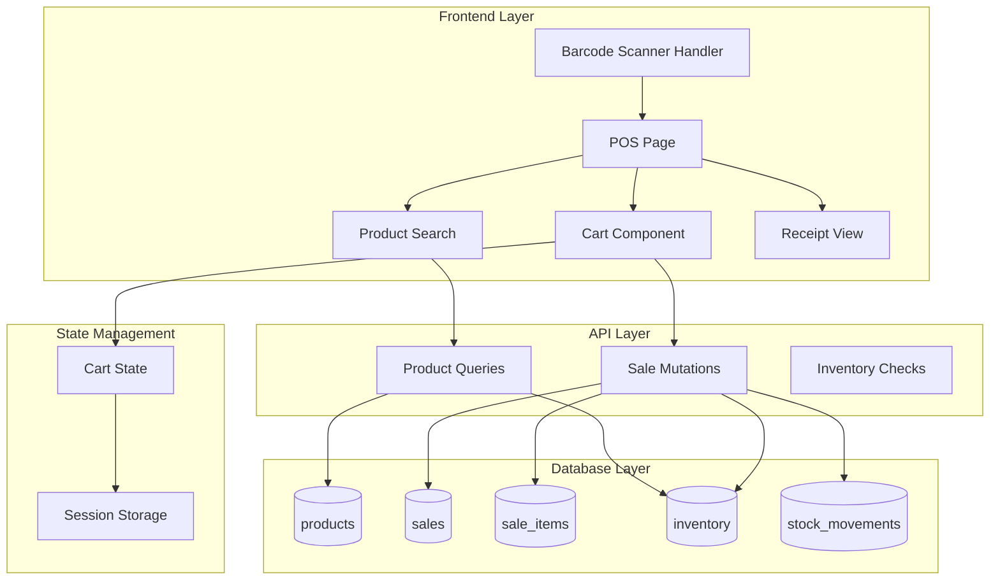
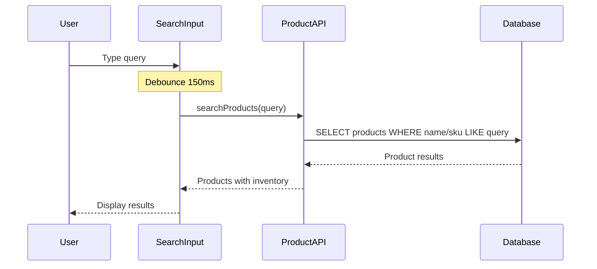
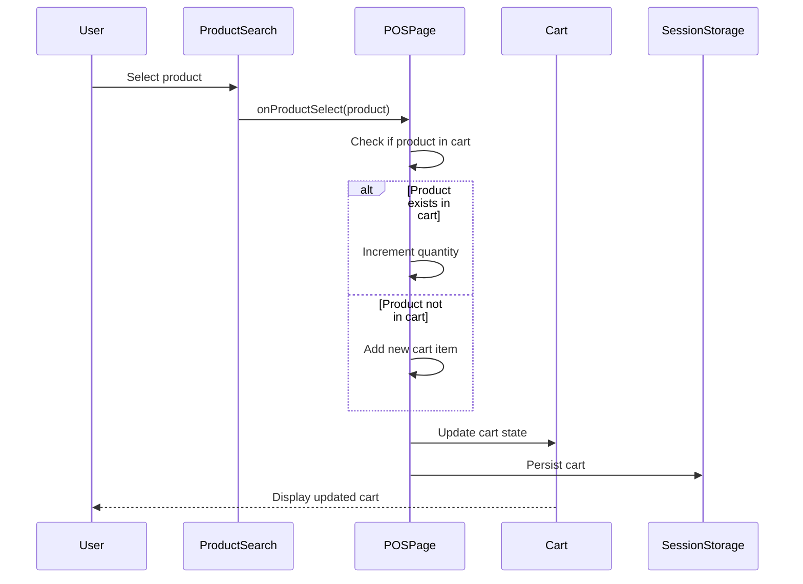
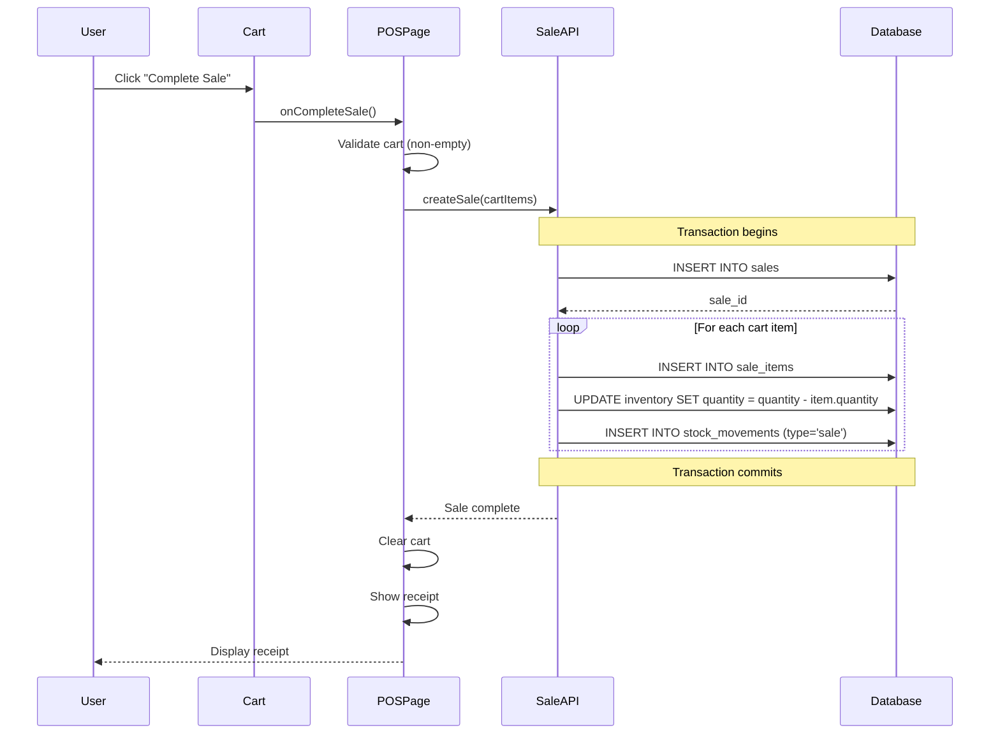
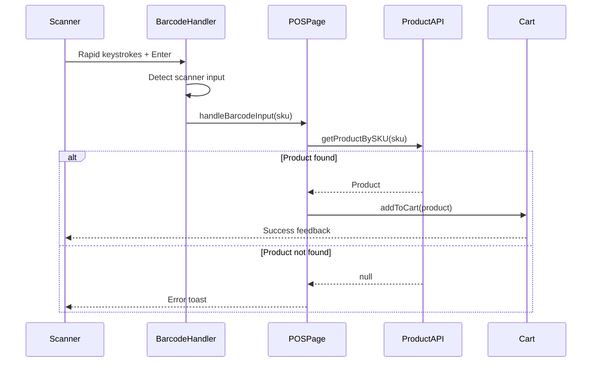

# Design Document: Talastock Lite POS

## Overview

The Talastock Lite POS (Point of Sale) feature provides a dedicated, streamlined interface for processing sales transactions in real-time. This design builds upon the existing Talastock architecture, leveraging the current sales, inventory, and product management systems while introducing a specialized cashier-focused workflow.

### Design Goals

1. **Speed**: Sub-100ms product lookup and cart updates for rapid transaction processing
2. **Simplicity**: Minimal clicks to complete a sale (search → add → complete)
3. **Reliability**: Atomic transactions with automatic inventory synchronization
4. **Accessibility**: Touch-friendly interface optimized for tablet devices (768px+)
5. **Consistency**: Seamless integration with existing dashboard, sales, and inventory systems

### Key Design Decisions

- **Split-screen layout**: Product search on left, cart on right for optimal workflow
- **Global barcode listener**: No focus required, scanner input works anywhere
- **Session storage**: Cart persistence across page refreshes
- **Optimistic UI**: Instant feedback with background synchronization
- **Existing tables**: Reuse sales, sale_items, inventory, stock_movements tables

## Architecture

### High-Level Architecture



### Component Hierarchy

```
POSPage (app/(dashboard)/pos/page.tsx)
├── ProductSearch
│   ├── SearchInput
│   └── ProductSearchResults
│       └── ProductSearchItem
├── POSCart
│   ├── CartHeader
│   ├── CartItemList
│   │   └── CartItem
│   ├── CartSummary
│   └── CartActions
└── ReceiptView
    ├── ReceiptHeader
    ├── ReceiptItemList
    └── ReceiptActions
```

## Components and Interfaces

### 1. POSPage Component

**Location**: `frontend/app/(dashboard)/pos/page.tsx`

**Responsibilities**:
- Orchestrate POS workflow
- Manage cart state
- Handle barcode scanner input
- Coordinate product search and cart interactions
- Manage transaction completion flow

**State**:
```typescript
interface POSPageState {
  cart: CartItem[]
  searchQuery: string
  isProcessing: boolean
  showReceipt: boolean
  lastSaleId: string | null
  offlineMode: boolean
}

interface CartItem {
  product: Product
  quantity: number
  unitPrice: number
}
```

**Key Methods**:
- `addToCart(product: Product): void`
- `updateQuantity(productId: string, quantity: number): void`
- `removeFromCart(productId: string): void`
- `completeSale(): Promise<void>`
- `clearCart(): void`
- `handleBarcodeInput(sku: string): void`

### 2. ProductSearch Component

**Location**: `frontend/components/pos/ProductSearch.tsx`

**Responsibilities**:
- Debounced search input (150ms)
- Display search results with product details
- Handle product selection
- Show stock status indicators

**Props**:
```typescript
interface ProductSearchProps {
  onProductSelect: (product: Product) => void
  disabled?: boolean
}
```

**Search Algorithm**:
- Search by: product name, SKU, category name
- Filter: `is_active = true`
- Limit: 10 results
- Order: Relevance score (exact SKU match > name match > category match)

### 3. POSCart Component

**Location**: `frontend/components/pos/POSCart.tsx`

**Responsibilities**:
- Display cart items with quantity controls
- Calculate and display subtotals and total
- Show stock warnings
- Provide complete sale action
- Handle cart clearing

**Props**:
```typescript
interface POSCartProps {
  items: CartItem[]
  onUpdateQuantity: (productId: string, quantity: number) => void
  onRemoveItem: (productId: string) => void
  onCompleteSale: () => void
  onClearCart: () => void
  isProcessing: boolean
  offlineMode: boolean
}
```

**Calculations**:
```typescript
// Subtotal per item
subtotal = quantity * unitPrice

// Cart total
total = sum(all item subtotals)
```

### 4. ReceiptView Component

**Location**: `frontend/components/pos/ReceiptView.tsx`

**Responsibilities**:
- Display completed sale details
- Show sale ID, timestamp, items, total
- Provide print functionality
- Allow starting new sale

**Props**:
```typescript
interface ReceiptViewProps {
  sale: Sale
  onNewSale: () => void
}
```

### 5. Barcode Scanner Handler

**Location**: `frontend/hooks/useBarcodeScanner.ts`

**Responsibilities**:
- Listen for rapid keyboard input (scanner detection)
- Distinguish scanner input from manual typing
- Trigger product lookup on Enter key
- Handle invalid SKU errors

**Implementation**:
```typescript
interface BarcodeScannerConfig {
  minInputSpeed: number // 50ms between chars = scanner
  onScan: (sku: string) => void
  enabled: boolean
}

function useBarcodeScanner(config: BarcodeScannerConfig): void {
  // Global keyboard event listener
  // Buffer input characters
  // Detect rapid input (< 50ms between chars)
  // On Enter: trigger onScan callback
  // Clear buffer after 100ms idle
}
```

### 6. Navigation Integration

**Sidebar Update**: Add POS navigation item

**Location**: `frontend/components/layout/Sidebar.tsx`

```typescript
const navItems = [
  { label: 'Dashboard', href: '/dashboard', icon: LayoutDashboard },
  { label: 'Products', href: '/products', icon: Package },
  { label: 'Categories', href: '/categories', icon: Tag },
  { label: 'Inventory', href: '/inventory', icon: Boxes },
  { label: 'POS', href: '/pos', icon: ShoppingCart }, // NEW
  { label: 'Sales', href: '/sales', icon: TrendingUp },
  { label: 'Transactions', href: '/transactions', icon: Receipt },
  { label: 'Reports', href: '/reports', icon: FileText },
]
```

**Dashboard Quick Access**: Add Quick POS button

**Location**: `frontend/app/(dashboard)/dashboard/page.tsx`

```typescript
<Link href="/pos">
  <button className="flex items-center gap-2 h-10 px-4 rounded-lg bg-[#E8896A] hover:bg-[#C1614A] text-white text-sm font-medium transition-colors">
    <ShoppingCart className="w-4 h-4" />
    Quick POS
  </button>
</Link>
```

## Data Models

### Cart Item (Frontend Only)

```typescript
interface CartItem {
  product: Product          // Full product object
  quantity: number          // Current quantity in cart
  unitPrice: number         // Price at time of adding (may differ from product.price)
  subtotal: number          // Calculated: quantity * unitPrice
  stockWarning?: boolean    // True if quantity > available inventory
}
```

### Sale Transaction (Database)

Uses existing `sales` table:

```sql
CREATE TABLE sales (
  id UUID PRIMARY KEY DEFAULT gen_random_uuid(),
  total_amount NUMERIC(10,2) NOT NULL,
  notes TEXT,
  created_by UUID REFERENCES auth.users(id),
  created_at TIMESTAMPTZ DEFAULT NOW()
);
```

### Sale Item (Database)

Uses existing `sale_items` table:

```sql
CREATE TABLE sale_items (
  id UUID PRIMARY KEY DEFAULT gen_random_uuid(),
  sale_id UUID REFERENCES sales(id) ON DELETE CASCADE,
  product_id UUID REFERENCES products(id) ON DELETE RESTRICT,
  quantity INTEGER NOT NULL,
  unit_price NUMERIC(10,2) NOT NULL,
  subtotal NUMERIC(10,2) GENERATED ALWAYS AS (quantity * unit_price) STORED
);
```

### Stock Movement (Database)

Uses existing `stock_movements` table:

```sql
CREATE TABLE stock_movements (
  id UUID PRIMARY KEY DEFAULT gen_random_uuid(),
  product_id UUID REFERENCES products(id) ON DELETE CASCADE,
  type TEXT CHECK (type IN ('restock', 'sale', 'adjustment', 'return', 'import', 'rollback')),
  quantity INTEGER NOT NULL,
  note TEXT,
  created_by UUID REFERENCES auth.users(id),
  created_at TIMESTAMPTZ DEFAULT NOW()
);
```

## Data Flow

### Product Search Flow



### Add to Cart Flow



### Complete Sale Flow



### Barcode Scanner Flow



## API Endpoints

### Product Search

**Endpoint**: `GET /api/products/search`

**Query Parameters**:
- `q`: Search query (name, SKU, category)
- `limit`: Max results (default: 10)

**Response**:
```typescript
{
  success: true,
  data: Product[],
  message: "Products found"
}
```

**Implementation** (uses existing Supabase query):
```typescript
const { data } = await supabase
  .from('products')
  .select('*, categories(name), inventory(quantity, low_stock_threshold)')
  .eq('is_active', true)
  .or(`name.ilike.%${query}%,sku.ilike.%${query}%`)
  .limit(10)
```

### Get Product by SKU

**Endpoint**: `GET /api/products/sku/:sku`

**Response**:
```typescript
{
  success: true,
  data: Product | null,
  message: "Product found" | "Product not found"
}
```

**Implementation**:
```typescript
const { data } = await supabase
  .from('products')
  .select('*, categories(name), inventory(quantity, low_stock_threshold)')
  .eq('sku', sku)
  .eq('is_active', true)
  .single()
```

### Create Sale (POS)

**Endpoint**: `POST /api/sales/pos`

**Request Body**:
```typescript
{
  items: Array<{
    product_id: string
    quantity: number
    unit_price: number
  }>
  notes?: string
}
```

**Response**:
```typescript
{
  success: true,
  data: {
    sale: Sale
    items: SaleItem[]
  },
  message: "Sale completed successfully"
}
```

**Implementation** (atomic transaction):
```typescript
async function createPOSSale(data: POSSaleCreate, userId: string) {
  // 1. Create sale record
  const { data: sale } = await supabase
    .from('sales')
    .insert({
      total_amount: calculateTotal(data.items),
      notes: data.notes,
      created_by: userId
    })
    .select()
    .single()
  
  // 2. Create sale items
  const saleItems = data.items.map(item => ({
    sale_id: sale.id,
    product_id: item.product_id,
    quantity: item.quantity,
    unit_price: item.unit_price
  }))
  
  await supabase.from('sale_items').insert(saleItems)
  
  // 3. Update inventory and create stock movements
  for (const item of data.items) {
    // Decrement inventory
    await supabase.rpc('decrement_inventory', {
      p_product_id: item.product_id,
      p_quantity: item.quantity
    })
    
    // Create stock movement
    await supabase.from('stock_movements').insert({
      product_id: item.product_id,
      type: 'sale',
      quantity: -item.quantity,
      note: `POS Sale #${sale.id}`,
      created_by: userId
    })
  }
  
  return sale
}
```

### Check Inventory

**Endpoint**: `GET /api/inventory/:productId`

**Response**:
```typescript
{
  success: true,
  data: {
    product_id: string
    quantity: number
    low_stock_threshold: number
    status: 'in_stock' | 'low_stock' | 'out_of_stock'
  }
}
```

## Error Handling

### Error Types

1. **Network Errors**: Connection lost, timeout
2. **Validation Errors**: Empty cart, invalid quantities
3. **Stock Errors**: Insufficient inventory
4. **Authentication Errors**: Session expired
5. **Database Errors**: Transaction failures

### Error Handling Strategy

```typescript
// Toast notifications for user-facing errors
try {
  await completeSale()
  toast.success('Sale completed successfully')
} catch (error) {
  if (error instanceof NetworkError) {
    toast.error('Network error. Please check your connection.')
  } else if (error instanceof ValidationError) {
    toast.error(error.message)
  } else if (error instanceof StockError) {
    toast.warning('Some items have insufficient stock')
  } else {
    toast.error('Failed to complete sale. Please try again.')
  }
  // Log to console for debugging
  console.error('Sale completion error:', error)
}
```

### Transaction Rollback

All sale operations use database transactions. If any step fails, the entire transaction rolls back:

```typescript
// Supabase handles transactions automatically
// If any query fails, all changes are rolled back
try {
  await supabase.rpc('create_pos_sale', { /* params */ })
} catch (error) {
  // Transaction automatically rolled back
  // No partial sales or inventory updates
  throw error
}
```

### Offline Handling

```typescript
// Detect offline state
const [isOffline, setIsOffline] = useState(false)

useEffect(() => {
  const handleOnline = () => setIsOffline(false)
  const handleOffline = () => setIsOffline(true)
  
  window.addEventListener('online', handleOnline)
  window.addEventListener('offline', handleOffline)
  
  return () => {
    window.removeEventListener('online', handleOnline)
    window.removeEventListener('offline', handleOffline)
  }
}, [])

// Disable complete sale button when offline
<button
  disabled={isOffline || cart.length === 0}
  onClick={completeSale}
>
  {isOffline ? 'Offline' : 'Complete Sale'}
</button>
```

## Testing Strategy

### Property-Based Testing Applicability

**Property-based testing (PBT) is NOT applicable to this feature** for the following reasons:

1. **UI-Heavy Feature**: The POS interface is primarily a UI component with user interactions (search, cart display, button clicks). PBT is not suitable for UI rendering and layout testing.

2. **Transaction-Based Operations**: The core functionality involves database transactions (creating sales, updating inventory) which are better tested with example-based integration tests that verify specific scenarios.

3. **Side-Effect Operations**: Sale completion triggers multiple side effects (database writes, inventory updates, stock movements) that don't have universal properties to test across random inputs.

4. **State Management**: Cart state and session persistence are stateful operations that require specific test scenarios rather than property-based validation.

**Testing Approach**: This feature will use **unit tests** for component logic, **integration tests** for transaction flows, and **end-to-end tests** for complete user workflows.

### Unit Tests

**Product Search Component**:
- Search by product name returns correct results
- Search by SKU returns exact match
- Search respects is_active filter
- Search limits results to 10 items
- Empty search returns empty results
- Debounce delays search by 150ms
- Search displays stock status correctly

**Cart Management Logic**:
- Adding product increments quantity if already in cart
- Adding product creates new cart item if not in cart
- Updating quantity to 0 removes item from cart
- Removing item clears it from cart
- Cart total calculates correctly (sum of all subtotals)
- Subtotal calculates correctly (quantity × unit_price)
- Stock warnings appear when quantity > inventory

**Barcode Scanner Hook**:
- Rapid input (< 50ms between chars) detected as scanner
- Manual typing (> 50ms between chars) not detected as scanner
- Valid SKU triggers product lookup
- Invalid SKU shows error toast
- Scanner works without input focus
- Buffer clears after 100ms idle

**Stock Validation**:
- Warning shown when cart quantity > inventory quantity
- Out of stock products (quantity = 0) marked in search results
- Low stock products (quantity ≤ threshold) marked in search results
- Stock status calculated correctly (in_stock, low_stock, out_of_stock)

**Session Storage**:
- Cart persists to session storage on update
- Cart loads from session storage on mount
- Cart clears from session storage on sale completion

### Integration Tests

**Complete Sale Transaction Flow**:
- Sale record created with correct total_amount
- Sale items created for all cart items with correct quantities and prices
- Inventory decremented by correct quantity for each product
- Stock movements created with type='sale' and negative quantities
- Transaction rolls back if any step fails (atomic operation)
- Cart cleared after successful sale
- Receipt displayed with correct sale details

**Product Lookup Integration**:
- Search query returns products with inventory data
- SKU lookup returns single product with inventory data
- Products filtered by is_active = true
- Results include category information

**Session Persistence**:
- Cart persists across page refresh
- Cart cleared after sale completion
- Cart cleared on manual clear action
- Cart recovered after re-authentication

**Dashboard Synchronization**:
- New sale appears in sales list immediately after completion
- Dashboard metrics update to reflect new sale
- Inventory quantities update in inventory page
- Stock movements appear in transactions page

### End-to-End Tests

**Manual Product Selection Flow**:
1. Navigate to POS page
2. Search for product by name
3. Select product from results
4. Verify product added to cart
5. Update quantity
6. Complete sale
7. Verify receipt displayed
8. Verify sale appears in sales list

**Barcode Scanner Flow**:
1. Navigate to POS page
2. Scan barcode (simulate rapid input + Enter)
3. Verify product added to cart
4. Scan same barcode again
5. Verify quantity incremented
6. Complete sale
7. Verify inventory decremented

**Stock Warning Flow**:
1. Add product to cart with quantity > available inventory
2. Verify stock warning displayed
3. Attempt to complete sale
4. Verify sale completes (warning only, not blocking)
5. Verify inventory updated correctly

**Offline Handling Flow**:
1. Navigate to POS page
2. Disconnect network
3. Verify offline banner displayed
4. Verify complete sale button disabled
5. Add products to cart (should still work)
6. Reconnect network
7. Verify offline banner removed
8. Complete sale successfully

### Performance Tests

**Response Time Requirements**:
- Product search completes in < 100ms (measured from query to results display)
- Cart updates render in < 50ms (measured from action to UI update)
- Sale completion completes in < 500ms (measured from button click to receipt display)
- Page load completes in < 100ms (measured from navigation to interactive)

**Load Testing**:
- Cart handles 50+ items without performance degradation
- Search handles 1000+ products without lag
- Concurrent sales from multiple users don't cause conflicts

### Test Coverage Goals

- **Unit Tests**: 80% code coverage for components and hooks
- **Integration Tests**: 100% coverage of critical transaction flows
- **End-to-End Tests**: Coverage of all user workflows in requirements
- **Performance Tests**: All performance requirements validated

## Performance Optimizations

### 1. Debounced Search

```typescript
const debouncedSearch = useDebounce(searchQuery, 150)

useEffect(() => {
  if (debouncedSearch) {
    searchProducts(debouncedSearch)
  }
}, [debouncedSearch])
```

### 2. Indexed Database Queries

Ensure indexes exist on frequently queried columns:

```sql
CREATE INDEX idx_products_sku ON products(sku);
CREATE INDEX idx_products_name ON products(name);
CREATE INDEX idx_products_is_active ON products(is_active);
```

### 3. Optimistic UI Updates

```typescript
// Update cart immediately (optimistic)
setCart(prev => [...prev, newItem])

// Persist to session storage (background)
sessionStorage.setItem('pos_cart', JSON.stringify(cart))
```

### 4. Session Storage for Cart

```typescript
// Load cart from session storage on mount
useEffect(() => {
  const savedCart = sessionStorage.getItem('pos_cart')
  if (savedCart) {
    setCart(JSON.parse(savedCart))
  }
}, [])

// Save cart to session storage on change
useEffect(() => {
  sessionStorage.setItem('pos_cart', JSON.stringify(cart))
}, [cart])
```

### 5. Memoized Calculations

```typescript
const cartTotal = useMemo(() => {
  return cart.reduce((sum, item) => sum + item.subtotal, 0)
}, [cart])

const hasStockWarnings = useMemo(() => {
  return cart.some(item => item.stockWarning)
}, [cart])
```

## Security Considerations

### Authentication

- All POS routes require authentication
- Session validation on every API call
- Redirect to login if session expired
- Cart preserved in session storage for recovery after re-auth

### Authorization

- Only authenticated users can access POS
- Sale records include `created_by` field for audit trail
- Stock movements include `created_by` for accountability

### Input Validation

```typescript
// Validate cart before submission
function validateCart(cart: CartItem[]): boolean {
  if (cart.length === 0) {
    throw new ValidationError('Cart is empty')
  }
  
  for (const item of cart) {
    if (item.quantity <= 0) {
      throw new ValidationError('Invalid quantity')
    }
    if (item.unitPrice < 0) {
      throw new ValidationError('Invalid price')
    }
  }
  
  return true
}
```

### SQL Injection Prevention

- All queries use Supabase parameterized queries
- No string concatenation in SQL
- Input sanitization handled by Supabase client

### XSS Prevention

- React escapes all user input by default
- No use of `dangerouslySetInnerHTML`
- Product names and SKUs sanitized before display

## Deployment Considerations

### Environment Variables

```env
# Frontend (.env.local)
NEXT_PUBLIC_SUPABASE_URL=https://xxx.supabase.co
NEXT_PUBLIC_SUPABASE_ANON_KEY=eyJxxx
```

### Database Migrations

No new tables required. Uses existing schema:
- `sales`
- `sale_items`
- `inventory`
- `stock_movements`
- `products`

### Feature Flags

```typescript
// Enable/disable POS feature
const POS_ENABLED = process.env.NEXT_PUBLIC_POS_ENABLED === 'true'

// Conditionally show POS nav item
{POS_ENABLED && (
  <NavItem href="/pos" icon={ShoppingCart} label="POS" />
)}
```

### Monitoring

- Log all sale completions with timestamp and user ID
- Track average sale completion time
- Monitor cart abandonment rate
- Alert on high error rates

## Future Enhancements

### Phase 2 Features

1. **Multiple Payment Methods**: Cash, card, e-wallet
2. **Customer Management**: Link sales to customer records
3. **Discounts and Promotions**: Apply percentage or fixed discounts
4. **Receipt Printing**: Direct printer integration
5. **Offline Mode**: Queue sales when offline, sync when online
6. **Multi-currency Support**: Handle different currencies
7. **Split Payments**: Multiple payment methods per sale
8. **Returns and Refunds**: Process returns through POS
9. **Cash Drawer Management**: Track cash in/out
10. **Shift Management**: Track sales by cashier shift

### Technical Debt

- Consider React Query for better caching and synchronization
- Implement WebSocket for real-time inventory updates
- Add comprehensive error boundary for POS page
- Implement analytics tracking for POS usage patterns

---

## Appendix

### UI Mockup (Text-based)

```
┌─────────────────────────────────────────────────────────────┐
│ Talastock POS                                    [Dashboard] │
├─────────────────────────────────────────────────────────────┤
│                                                               │
│  ┌──────────────────────────┐  ┌──────────────────────────┐ │
│  │ Product Search           │  │ Cart                     │ │
│  ├──────────────────────────┤  ├──────────────────────────┤ │
│  │ [Search products...]     │  │ Product A  x2   ₱200.00 │ │
│  │                          │  │ Product B  x1   ₱150.00 │ │
│  │ Results:                 │  │ Product C  x3   ₱450.00 │ │
│  │ • Product A - ₱100.00    │  │                          │ │
│  │ • Product B - ₱150.00    │  │ ─────────────────────── │ │
│  │ • Product C - ₱150.00    │  │ Total:         ₱800.00  │ │
│  │                          │  │                          │ │
│  │                          │  │ [Clear Cart]             │ │
│  │                          │  │ [Complete Sale]          │ │
│  └──────────────────────────┘  └──────────────────────────┘ │
│                                                               │
└─────────────────────────────────────────────────────────────┘
```

### Database Schema Reference

See `database/schema-complete.sql` for full schema details.

### Related Documentation

- Requirements: `.kiro/specs/talastock-lite-pos/requirements.md`
- UI Components Guide: `ui-components.md`
- Supabase Conventions: `supabase-conventions.md`
- Security Standards: `security-standards.md`

